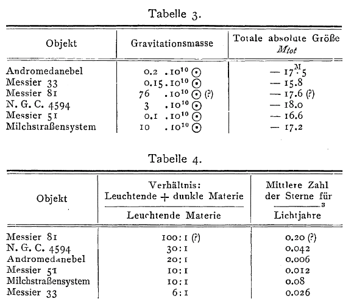

------------------------------------------------------------------------------------------

# Introduction

\noindent Dark matter is unusually stable at the level of gravitational and cosmological phenomenology while remaining deeply open at the level of constituent nature. While many lines of gravitational and cosmological modelling support the existence of a non-luminous mass component, the nature of that component remains open, and decades of direct-search efforts have not delivered an agreed non-gravitational detection. This combination --- robust *dynamical* support and persistent *microphysical* opacity --- has helped generate both ontological divergence (a proliferation of candidates and frameworks) and periodic methodological self-scrutiny within the field (@2018Bertone_Tait; @merritt2021cosmological).

In epistemic situations of this kind, disciplinary orientation is not provided only by new measurements and new models. It is also provided by synthetic texts that organise the research landscape, stabilise what counts as a 'live' target of inquiry, and articulate why continued commitment is rational. A striking example in the dark matter case is the prominence of explicitly historical syntheses---texts that do not merely survey current constraints, but narrate a lineage from earlier scientific episodes to present-day dark matter research. Bertone \& Hooper's *A History of Dark Matter* [@bertone2018history] is a particularly visible instance: it presents itself as a history, it is heavily cited across subfields, and it offers an interpretive bridge between early twentieth-century 'missing mass' arguments and late twentieth-/twenty-first-century particle-motivated search strategies.

This paper argues that such research histories perform a distinctive kind of epistemic work in unresolved research programmes. They function as *epistemic structures*: by narrating continuity, they stabilize reference (what 'dark matter' is taken to pick out), soften the appearance of conceptual rupture, and thereby help legitimate ongoing theoretical and experimental investment. The central claim is not that physicists who write histories are uniquely prone to error, nor that historical narrative is merely rhetorical ornament. The claim is that, *in a live and unsettled field of inquiry*, continuity narratives can become a *supporting structure* for realism-leaning attitudes and for the perceived unity of a research target --- and that this role makes the historical and semantic details consequential rather than incidental.[^1]

[^1]: See @Vanderburgh2014-VANQPE, @kragh2014testability[; @kragh2017fundamental], @merritt2021cosmological[; @merritt2021mond], @jacquart2021lambdacdm, @allzen2021scientific, @SiskaRichard2022mond, @martens2022integrating, @antoniou2023robustness, and @vaynberg2024realism for discussions on the philosophy of dark matter.

The dark matter case is especially revealing because the term 'dark matter' has not been historically univocal. Alongside the now-familiar dynamical sense ('missing mass' inferred from gravitational phenomena), early and mid-twentieth-century usage frequently connected dark matter to *light-obscuring* matter --- dust, gas, and absorption effects. When contemporary research histories present 'dark matter' as a concept that gradually sharpened into today's non-baryonic particle-like target, they often do so by selective anchoring in the dynamical lineage and by reclassifying other uses as mere 'prehistory'. The paper's historical analysis reconstructs that heterogeneity and uses it to illuminate how continuity is manufactured and what that manufacturing buys epistemically.

The aim, however, is deliberately narrow. This paper identifies one mechanism of target stabilization in practice; it does not by itself attempt to settle the full diachronic semantics of the term 'dark matter'.

Methodologically, the paper combines (i) a full-text ADS corpus of records containing the phrase 'dark matter' to locate and contextualize influential historical syntheses, with (ii) close textual analysis of a flagship research history, and (iii) targeted reconstruction of earlier usage from primary and near-primary sources. The ADS component is not meant as a sociological survey of the entire field; it serves a narrower purpose: to justify case selection and to situate the chosen research history in the communicative economy of dark matter physics. The close reading and historical reconstruction then identify the mechanism by which continuity is built.


# Research history as epistemic structure

\noindent I use the term *research history* for a genre of scientific synthesis that is simultaneously retrospective and programmatic: it narrates a past in order to orient present practice. In physics, such narratives are familiar in commemorative volumes and canonical review essays, where the past is organised so as to make a current research trajectory appear continuous, intelligible, and worth pursuing [@pestre1999commemorative; @kragh_1987]. The key point is not that these texts are 'merely' rhetorical, but that their rhetorical functions can be epistemically significant: by selecting turning points, defining lineages, and identifying stable targets across conceptual change, they help determine what the community treats as the same object of inquiry over time.

In the present context, the most important function of a research history is *continuity construction*. Continuity claims do two things at once. First, they provide a diachronic story in which present-day dark matter research is the continuation of earlier scientific successes, rather than a speculative detour. Second, they stabilise reference by implicitly specifying which historical uses of 'dark matter' count as tracking the same target and which count as incidental. These two functions are tightly connected: the more successfully continuity is narrated, the more natural it can seem that 'dark matter' has been a single, gradually sharpening target all along.

To make the epistemic role of research histories precise, I treat continuity-construction as
a three-stage mechanism that operates on an unresolved target of inquiry.

1.  Anchoring  
A research history first selects which earlier episodes, actors, and uses of a term count as relevant antecedents of the present target. This is an act of *anchoring*: it identifies privileged nodes in the past (and a privileged sense of the term) that can bear the weight of a continuity claim.

2.  Stabilization  
The selected anchors are then used to stabilize what the term is taken to pick out across time. Stabilization is achieved by treating heterogeneous past uses as either (i) partial glimpses of the same target, or (ii) merely 'prehistory' whose divergence is not conceptually constitutive. The effect is to make it natural to speak as if there were a single, gradually sharpening object of inquiry all along.

3.  Rationalization  
Once the target is stabilized diachronically, continuity can be converted into a
forward-looking reason for commitment: the programme appears coherent, cumulative, and historically well-motivated. In this way, narrative continuity does not replace empirical work, but functions as a supporting structure that legitimizes ongoing theoretical and experimental investment under conditions of underdetermination.

\noindent The remainder of the paper is organised to track these three operations. Section 3.1 uses citation-based evidence to show that explicitly historical syntheses in dark matter are not peripheral but high-uptake texts within the community, and it motivates the case selection of Bertone \& Hooper (2018) as a particularly influential site where continuity-work is performed. Section 3.2 then reconstructs how their *A History of Dark Matter* anchors the concept in early dynamical estimates and uses that anchoring to stabilize reference by framing alternative historical uses as 'prehistory'. Section 4 provides a counter-reconstruction of early twentieth-century usage that makes visible what stabilization requires in this case: namely, the systematic down-weighting of light-obscuring senses of 'dark matter' that were contemporaneously integrated with dynamical reasoning. Section 5 highlights two especially pertinent cases where light-absorption and dynamics are explicitly integrated in the dark matter concept. Finally, Section 6 draws the diagnostic implication: in unresolved research programmes, continuity narratives can do substantive epistemic work by selecting, stabilizing, and rationalizing a target --- which is precisely why the historical and semantic details matter.


# Continuity narrative in the history of dark matter

\noindent Writing the 'history of x' typically presupposes that x is a stable target. In this sense, writing the history of dark matter already at the outset presupposes that dark matter is a stable and concise concept about which there's a coherent history. The mere *act* of writing a (specific) history of dark matter while its nature and reality is an ongoing and unresolved research programme constitutes an argument at least for its existence, if not its nature.[^0] The content of that history is of great significance because, according to @staley2008einstein [296], *"scientists employ historical accounts to establish a canon and shape the boundaries of a disciplinary rereading of the past from the end of science"*. In the dark matter context, the present is a natural substitute for the end, i.e. as the viewpoint from which one can interpret the past. The kind of historical account I will be concerned with may be labeled "research history" and can be defined as:

> explicitly historical but highly selective accounts of the emergence and implication of
> a theory, experiment, or discovery that are presented in major research or research
> review papers. [@staley2008einstein, 297]

[^0]: One could argue that history written about abandoned concepts or non-existing entities (e.g., history of alchemy, flogiston, caloric theory of heat) is a perfectly legitimate endeavor which does not imply the existence of these entities. However, in such cases, the history often serves to illustrate the evolution and progress of theory development or the construction and evolution of ideas. Additionally, such histories are often written with the benefit of hindsight, where the non-existence of the entity is already established. In contrast, writing a history of dark matter while its existence is still an open question carries different implications, as it can influence current perceptions and commitments within the scientific community.

\noindent For example, if one's viewpoint contains a particular characterization of dark matter, a history of dark matter becomes a history of that particular characterization. Selectively presenting parts of history that support a particular characterization promotes a narrative that implies continuity in the usage and understanding of the central terms between past scientists and their present counterparts. Semantic continuity in terms of *referential* continuity encourages the community to treat the target as the same entity over time. In the context of dark matter, this strengthens the idea that, despite substantial theoretical change, our knowledge about dark matter has increased. However, if history shows discontinuity --- in other words that continuity is an artifact --- then claiming that the dark matter which @Zwicky1933 inferred was confirmed by @rubin1970rotation becomes an equivocation at worst and an account of continuity of the phenomena dark matter is taken to explain at best (rather than about dark matter itself). Worse still, if 'dark matter' as used by Zwicky referred to an entity understood to have properties *incompatible* with the entity currently understood to be dark matter, pushing the notion of continuity in a linear historical progression of dark matter becomes an outright contradiction. 

Of course, semantic drift is not exceptional in the history of science; many central theoretical terms have shifted their meanings, reference, and inferential roles across time without this by itself being philosophically puzzling. The distinctive claim in the present case is not that discontinuity is surprising, but that in an unresolved programme continuity narratives can have epistemic consequences: they help coordinate what later researchers take the target to be and how it is supposed to be tracked through evidential change. This is why the question is not merely whether "dark matter" has had multiple historical uses, but which uses are treated as constitutive antecedents and which are demoted to "prehistory". When that sorting work is performed by a high-uptake research history, it can shape communal expectations about reference and thereby function as a practical reason for sustained commitment under underdetermination.

## The prevalence and impact of history in dark matter

\noindent Histories often consolidate after theoretical and conceptual stabilization, but the dark matter case shows a high-impact historical narrative during a phase in the research progress that is still wide open and unsettled. The usual benefit of hindsight enables historians to discern the patterns which led scientists astray, when a theory has been falsified, or trace the key insights pointing towards truth, in case of its confirmation. The presence of accounts on the history of dark matter is therefore epistemically significant, considering that it's currently one of the biggest *open* questions in physics. Even more significant is that a majority of these historical accounts were written by physicists actively working on the dark matter problem at the time. These histories of dark matter are not simply autobiographical memorabilia peripheral to the standing of dark matter in the broader community but are of great interest to a majority of the physicists currently working on dark matter. The high level of impact generated by a paper on the history of dark matter within the physics community tells us that it's an incredibly popular topic among its members. More importantly, however, it tells us that the content and epistemic narrative presented in a historical account may seriously shape the community regarding the genesis and pedigree of the *current* dark matter hypothesis. Support for the latter claim can be found by looking in cosmology textbooks, popular science media, and encyclopedic entries. it's not uncommon to come across dense historical claims in these sources, often in some version of the following proposition:

> Originally known as the "missing mass", dark matter’s existence was first inferred by
> Swiss American astronomer Fritz Zwicky, who in 1933 discovered that the mass of all the
> stars in the Coma cluster of galaxies provided only about 1 percent of the mass needed
> to keep the galaxies from escaping the cluster’s gravitational pull. The reality of this
> missing mass remained in question for decades, until the 1970s when American astronomers
> Vera Rubin and W. Kent Ford confirmed its existence. [@Encbrittanica]

\noindent This nugget of dark-matter history is not to be faulted for its lack of depth, considering that it's an encyclopedia entry. However, the fact that a historical description even *is* included in an encyclopedia entry suggests its significance for the general perception of dark matter. The entry, though short and dense, manages to nonetheless represent the physicist perspective fairly accurately. Although the scope, depth, and details vary, the usual starting point is Fritz @Zwicky1933; @zwicky1937masses studies of the Coma cluster, in which he found that luminous mass alone could not fully explain the galactic movements in the cluster. He concluded that there must be some 'dunkle materie' in the cluster, the presence of which would explain the dynamics. It's popular to credit Zwicky for introducing the term ‘dark matter’, often followed by berating the contemporary scientific community for overlooking the magnitude of Zwicky's incredible discovery. Below are three such examples:

> Unquestionably, Fritz Zwicky was the first to propose this form of dark matter, although
> for 30 years after his proposal, it was largely unappreciated [$\dots$] It took about 40
> years for Zwicky’s insight to be fully accepted. [@Sanders2010, 12]

> Fritz Zwicky used a telescope [$\dots$] to measure the radial velocities of galaxies in
> the rich Coma cluster. He found surprisingly large velocity dispersions, indicating that
> the cluster density was much higher than the one derived from luminous matter alone. He
> named this invisible matter dark matter, and [$\dots$] in the 1970s, Vera Rubin and
> collaborators, and Albert Bosma measured the rotation curves of spiral galaxies and also
> found evidence for a missing mass component. [@baudis2016dark, 1]

> the evidence for something beyond stars began with Zwicky and the Coma cluster, where
> Zwicky described the need for dark matter to hold the Coma galaxies together.
> [@Turner_2022, 9]

\noindent According to these historical narratives, Zwicky's work represents the genesis
of dark matter. The portrait of Zwicky as a "pioneer" [@bertone2018history, 13] or
"one of those rare unorthodox geniuses" [@Sanders2010, 12] is a curiously frequent
aspect of the narrative. @van1999early [657] even goes as far as claiming that "The
discovery by Zwicky that visible matter accounts for only a tiny fraction of all of the
mass in the universe may turn out to have been one of the most profound new insights
produced by scientific exploration during the 20th century."

This dense and simplified history of dark matter presumably reaches the greatest number of
people, influencing the perception of dark matter's history within the general population.
Despite its presumed impact, the simplified version is not an interesting subject for
further analysis, considering that it lacks historical accuracy by design, in order to
convey the general unfolding of events. However, including it in this context is useful
because it illustrates the condensed version present in what we previously labeled
*research history*. An example of the latter, and the subject for the remaining
analysis, is a review paper written by two astrophysicists currently working on dark
matter --- Dan Hooper and Gianfranco Bertone --- entitled *A History of Dark Matter*.

## A history of dynamics

\noindent The review paper by @bertone2018history is a comprehensive and thorough
account of many of the most important steps in the theoretical evolution of what is today
known as dark matter. The aim is to *"provide the reader with a broader historical
perspective on the observational discoveries and the theoretical arguments that led the
scientific community to adopt dark matter as an essential part of the standard
cosmological model"*. In a sense, the aim is to provide the reader with the arguments for
the existence of dark matter which convinced scientists to accept it. As such, the paper
should be treated as an epistemological endeavor as much as a historical one, especially
considering its high impact in the dark-matter community. 

Their account makes extensive use of primary historical sources and state-of-the-art knowledge of dark matter to provide a comprehensive overview of dark matter's *"interesting history, and how it came to be accepted as the standard explanation for a wide variety of astrophysical observations"* [@bertone2018history, 1] The first part of the paper is devoted to the conceptual origins of dark matter:

> We study the emergence of the concept of dark matter in the late 19th century and
> identify a series of articles and other sources that describe the first dynamical
> estimates for its abundance in the known Universe. [@bertone2018history, 4]


{#fig-impact fig-pos="H" width=90% fig-align="center"}


\noindent In the above, it's clear that the authors have already drawn a conceptual link
between *dynamical estimates* and dark matter. The emergence of the concept of dark
matter and the dynamical estimates of it are connected in contemporary history by means of
a few actors, which also serve as nodes of connection with the present:

> the pioneering work of Kapteyn, Jeans, Lindblad, Öpik and Oort opened the path toward
> modern determinations of the local dark matter density, a subject that remains of
> importance today, especially for experiments that seek to detect dark matter particles
> through their scattering with nuclei. [@bertone2018history, 12]

\noindent These actors are represented in the subsection "Dynamical Evidence", succeeding
"Dark Stars, Dark Planets, Dark Clouds" in the chapter "Prehistory". Chronologically
ordered, the sections provide the reader with sources referring to a kind of proto-concept
of dark matter present up until the end of the 19th century, a concept which is then
narrowed by the advent of dynamical evidence in the early 20th
century.[^16] In their study of the emergence of the concept of dark matter, and in opposition to the
simplified history, the authors emphasize that Zwicky's use of the term ‘dark matter’ was
in fact neither novel nor isolated, but instead argue that the term was ubiquitous among
his contemporaries:

[^16]: Interestingly, @bertone2018history [7] include black holes in the concept, "as an explicit example of a discussion of a class of invisible astrophysical objects, that populate the universe while residing beyond the reach of astronomical observations". Interesting because *invisible* and *non-luminous* are not co-extensive terms, a distinction we will revisit later.

> We [$\dots$] discuss the pioneering work of Zwicky within the context of the scientific
> developments of the early 20th century. [$\dots$] we find that his use of the term "dark
> matter" was in continuity with the contemporary scientific literature.
> [@bertone2018history, 4]

> Although [Zwicky] doesn’t explicitly cite any article, it is obvious [$\dots$] that he
> was well aware of the work of Kapteyn, Oort and Jeans discussed in the previous chapter.
> His use of the term "dark matter" is, therefore, in continuity with the community of
> astronomers that had been studying the dynamics of stars in the local Milky Way.
> [@bertone2018history, 14]

\noindent This account rejects the narrative trope of Zwicky as a lone and misunderstood
genius, and with it the notion that he was the first to "discover" that additional matter
was needed to explain the observed phenomena. Instead, the authors stress that Zwicky's
use of the phrase 'dark matter' conformed to the inferential and terminological practices
established in the contemporary scientific community, represented by Kapteyn, Oort, and
Jeans, i.e. the actors present in the section on dynamical evidence. Zwicky's results are
aligned with @SMITH1936, whose estimates of the mass of the Virgo Cluster appear in Hubble's *The Realm of Nebulae*. The account says little of the development in the years running up to the late 1960's, suggesting little or no significant work on the topic until then.

This narrative draws two implicit lines through history. The first line between
contemporary instances of the phrase 'dark matter', establishing its use in
*explanations of dynamical phenomena*, a characterization substantiated by
reference to the ubiquity of this usage by contemporary actors. The second line traces the
conceptual legacy of this characterization throughout the 20th century, implying heredity
with our modern characterization of dark matter. The conceptual continuity of dark matter
is preserved by the persistence of its semantic nucleus. The semantic or conceptual
continuity of 'dark matter' is key to justify the continuity of its *ontology*:
referential stability over time imply ontological continuity over time. Dark matter then
appears as a self-identical hypothesis over time, despite the extent of its theoretical
and conceptual evolution. I argue that the semantic continuity of the term 'dark matter'
is an artifact manifested by highlighting a path through history only visible through
the lens of a modern definition of dark matter.

## Uptake and distribution 

\noindent To test whether citing Bertone & Hooper (2018) is associated with the uptake of its historical structure, I extracted the subset of Bertone & Hooper’s own references published before 1960 (7 items) and asked whether later papers cite at least one of these "BH pre-1960 canon" references. This is not a causal identification; it is evidence of a patterned co-citation relationship consistent with BH functioning as a canon-normalizing reference point. In a stratum fixed-effects logistic model stratifying by year bin × arXiv category and controlling for reference-list length (log refs), papers citing Bertone & Hooper are substantially more likely to cite at least one of their pre-1960 references (OR = 6.79, 95% CI [5.08, 8.95]). 


{#fig-stratum fig-pos="H" width=100% fig-align="center"}


\noindent In other words, within the same year-bin and arXiv subfield, and comparing papers with similar-length reference lists, papers that cite Bertone & Hooper are measurably more likely to also cite at least one item from BH’s own pre-1960 "canon". In absolute terms, switching a paper’s status from not citing to citing Bertone & Hooper while holding its other covariates fixed increases the predicted probability of citing ≥1 reference found in Bertone & Hooper that pre-dates 1960 by ≈5.3 percentage points on average (median ≈4.4pp). This association persists even when restricting attention to papers that cite at least one pre-1960 reference, indicating that the effect is not solely driven by a general propensity to include very old citations. Furthermore, @fig-arxiv illustrates that papers citing Bertone \& Hooper are distributed across various arXiv categories and classifications, indicating that its influence extends beyond a single subfield. This widespread citation pattern suggests that the historical narrative presented in Bertone \& Hooper's paper resonates with researchers across high-energy physics, astrophysics, and general relativity and quantum cosmology, highlighting its role as a cross-community orienting review.

{#fig-arxiv fig-pos="H" width=100% fig-align="center"}

\noindent The above data is not meant to claim that a causal relationship between citing Bertone \& Hooper and believing that its content is correct is established. Rather, my point is that the data supports not only a broad, but also and deep, reproduction of their historical narrative. In what follows, I intend to compliment and provoke the continuity narrative presented in Bertone \& Hooper by revealing some of the internal semantic and conceptual tensions in the early uses of 'dark matter' that are downplayed or overlooked in their account.

# Dark matter: a conceptual duality

\noindent Although I agree with @bertone2018history that Zwicky's use of 'dark
matter' is in continuity with the established terminology in contemporary scientific
literature, I disagree with the proposed content of that terminology. The authors'
description of how the concept of dark matter was understood in the 1930s is formed by
the present dark matter concept: Kapteyn, Oort, and Jeans are taken as representative of
Zwicky's contemporary community only because the content of their work aligns with the
idea that dark matter is inextricably connected to *dynamical phenomena* --- a
connection not only compatible with, but central to, modern characterizations of dark
matter. The understanding of dark matter in early 20th-century astronomy can be determined
by examining the contemporary literature. Should uses of 'dark matter' diverge from the
characterization given by @bertone2018history, the semantic and ontological
continuity of dark matter implied by their history becomes opaque.

## Lord Kelvin and the 1884 Baltimore Lectures

\noindent In 1884, Sir William Thomson (henceforth [Lord] Kelvin) gave the Baltimore Lectures @Kelvin1884 at Johns Hopkins University. One of the topics concerned the velocity of stars in the Milky Way, in particular a star called "1830 Groomsbridge". Kelvin, recalling Newcombe's speculation, entertains the idea that the number of visible stars in the Milky Way is far from all the matter that exist:

>Newcomb has given a most interesting speculation regarding the very great velocity of 1830 Groombridge, which he concludes as follows: -- "If, then, the star in question belongs to our stellar system, the masses or extent of that system must be many times greater than telescopic observation and astronomical research indicate. We may place the dilemma in a concise form, as follows: -- Either the bodies which compose our universe are vastly more massive and numerous than telescopic examination seems to indicate, or 1830 Groombridge is a runaway star, flying on a boundless course through infinite space with such momentum that the attraction of all the bodies of the universe can never stop it." @Kelvin1884 [273 §16]

\noindent In the subsequent pages of the lecture notes, Kelvin assumes the former option, i.e. the hypothesis that there are vast quantities of ‘dark bodies’, or ‘dark stars’ which contribute to the dynamic behavior of a galactic system given that we treat the system as consisting of particles of gas. This method of analogy is then claimed to generate an estimate of the size of a system and the velocity dispersion of its stars:

>Many of our supposed thousand million stars, perhaps a great majority of them, may be dark bodies [...] It is nevertheless probable that there may be as many as 1000 million stars within the distance \textit{r} (5); but many of them may be extinct and dark, and nine-tenths of them though not all dark may be not bright enough to be seen by us at their actual distances. @Kelvin1884 [274 §18 -- 277 §20]


\noindent Kelvin clearly considers the possibility that luminous mass is a fraction of the total mass in the universe (which at the time was thought to be the Milky Way). It is also quite clear that he considers the ‘dark bodies’ to be extinct or low-luminous stars. This idea, although the lectures were given in 1884, did not reach scholars outside Johns Hopkins until the publication of Kelvin's lecture notes in 1904. The idea that non-luminous objects could inhabit our universe was shortly thereafter picked up by French polymath Henri Poincaré.

## Poincaré and the age of the Milky Way

\noindent In a paper on the application of the theory of gases on the Milky Way, @Poincare1906, building on Kelvin's 1884 method of analogy, provides a much lower estimate of the ratio between dark bodies and luminous ones, based on a comparison between Kelvin's results and empirical data from telescopic observation:

>There are the stars which we see because they shine; but might there not be obscure stars which circulate in the interstellar spaces and whose existence might long remain unknown? Very well then, that which Lord Kelvin’s method would give us would be the total number of stars including the dark ones; since his number is comparable to that which the telescope gives, then there is no \textit{dark matter}, or at least not so much as there is of shining matter. @Poincare1906 [480-1] [My italics]

\noindent Poincaré's paper focuses on extracting the stellar and galactic dynamics of the Milky Way from the application of the theory of gases: how the stars move; which velocities they have; if it can reach a stable equilibrium, and its evolution and age. He reasons from analogy that in the same way that the velocities in a system of gas eventually diminishes, so must the velocity of the stars, implying a limit of the age of the Milky Way. This reasoning, however, leads Poincaré to an impasse with respect to the quantity of dark matter, given that the average life of a star is considerably less than the (long but finite) age of the Milky Way:

>Must we believe that the evolution of the Milky Way began when matter was still dark? But how did the stars which compose it reach the adult age all at the same time, an age which is to last so brief a space? Or are they rather to reach it successively and are those that we see only a small minority compared with those which are extinct or that will one day shine out? But how shall we reconcile that with what we have said above about the absence of dark matter in considerable proportion? Should we abandon one of the two hypotheses, and which one? @Poincare1906 [488]

\noindent Here, dark matter is used to generate possible explanations for the discrepancy between Poincaré's calculated age of the Milky Way and the average lifespan of a star. He entertains the idea that all the luminous matter started out as dark matter that eventually evolved to form the luminous structures that we can observe. For this hypothesis to be the case, the stars will have had to all come of age simultaneously, and the luminous part of the total lifetime of the Milky Way must be a fraction of its total lifespan.\footnote{It is interesting to note that this hypothesis implies anthropic reasoning: if the luminous portion of the galaxy's lifetime is extremely small, the likelihood of observing luminous structures is extremely small. On the other hand, if we assume that luminosity is conducive to (or even necessary for) life, the likelihood of observing luminous structures is guaranteed insofar as there are observers at all.} The other option is to revert back to Lord Kelvin's estimate of the ratio between dark and luminous matter in the Milky Way, in which case there must be an abundance of dark matter in the galaxy which consist of matter which has not yet evolved to be luminous, and dead dark stars whose life has already come to and end. 

It stands to reason that Poincaré's use of the term ‘dark matter’ has two different motivations, or functions. The first usage implies that dark matter is some state of matter which has not yet evolved to form luminous structures. This may be gas, meteorites, or some other, more obscure, form of matter. The second usage takes dark matter to be the remnants of extinguished stars. While the two explanatory usages of the term can be said to be consistent with a single ontological basis for dark matter at some fundamental level -- baryonic matter -- such reasoning would be anachronistic at best. On the semantic side, ‘dark matter’ is evidently just used as a catch-all term for *any matter* that is not luminous (enough). 


## Kapteyn and Jeans -- dynamics and dark matter

\noindent In @Kapteyn1922, Dutch astronomer Jacobus Kapteyn published a paper which contained a theory of the dynamics and size of the Milky Way, a theory which he spent much of his life developing. In the abstract, Kapteyn describes what phenomena his theory -- "a general theory of the distribution of masses, forces and velocities in the sidereal system" -- can account for. For our purposes, the last suggested positive contribution of his theory is of most interest:

>It is incidentally suggested that when the theory is perfected it may be possible to determine the amount of dark matter from its gravitational effect. @Kapteyn1922 [302]


\noindent This suggestion owes to Kapteyn's calculation of the effective mass in the Milky Way, as given by the gravitational mass divided by the number of luminous stars, a number which he arrives at by inductively inferring the number of low-luminous stars from the empirical values given by the luminosity function:

>Remark. Dark matter. It is important to note that what has here been determined is the total mass within a definite volume, divided by the number of luminous stars. [\dots] Now suppose that in a volume of space containing \textit{l} luminous stars there be dark matter with an aggregate mass equal to \textit{Kl} average luminous stars; then, evidently the effective mass equals $(l+K)\times$ average mass of a luminous star. We therefore have the means of estimating the mass of dark matter in the universe. @Kapteyn1922 [314].


\noindent Although Kapteyn determined that the amount of dark matter in the Milky Way must be relatively small, it is nevertheless evident that the claim that there is non-luminous mass in the Milky Way is uncontroversial. In a paper published later the same year -- "The Motion of Stars in a Kapteyn Universe" -- @Jeans1922 argues that abandoning one of Kapteyn's (@Kapteyn1922 [314]) assumptions ("the average mass as derived from binary stars would have been very much lower than what has been found for the effective mass.") leads to another estimate of the amount of dark matter:

> Assuming the average star to have a mass of 0.8 times the sun’s mass, our value of M must be interpreted as showing that if the stars are in a steady state, there must be about three dark stars in the universe to every bright star. Subject to our being able to assume the existence of this very appreciable amount of dark matter, it appears that the observed motion of the stars can be explained. @Jeans1922 [130-1]


\noindent Jeans derives the mass of an "average star" by taking the mass of the average *visible* star and increase it by the ratio "of dark matter to visible stars in the universe" [126--7]. Again, both Kapteyn and Jeans appear to use ‘dark matter’ to refer to something like dark stars, or dark bodies. As with Poincaré, the ontology assumed here is that dark matter is simply matter without enough luminosity to be observed. For all intent and purposes, it is a distinction of degree, not of kind.

## Trumpler's light-obscuring mass

\noindent @Trumpler1932 provides one example of semantic divergence when attempting to explain a 'dark hole', captured in a photograph of the Sagittarius cloud of the Milky Way by
@Barnard1919. Trumpler refers to the cause of this phenomenon as 'dark, opaque
material'; 'obscuring masses'; 'dark obstacles'; 'dark matter'; and 'dark stuff' --- the
presence of matter which *interfered* with light coming from the otherwise dense
region of stars. Since the matter itself was not luminous, it caused the appearance of a
dark hole, leading Trumpler to speculate about a novel state of matter:

> The matter constituting our universe is evidently found in either of two states: In
> organized bodies like the Sun and the stars, which by their peculiar regular and
> symmetrical constitution have reached a stage of luminous radiation [$\dots$]; or in
> unorganized, chaotic masses of tiny particles irregularly scattered through vast space,
> mostly dark, only in few places becoming visible as nebulae. [@Trumpler1932, 182]

\noindent The core property of this dark matter is its ability to interact with light, a
property necessary to explain the phenomena. Importantly, Trumpler's dark matter is
*contemporarily compatible* with the dark matter of Oort, Kapteyn, Jeans, and
Zwicky. There were no contemporary reasons to distinguish Trumpler's dark matter from the
dark matter in Oort or Zwicky: *light-interactivity would have made no difference for its ability to explain dynamics*. Excluding Trumpler from representatives of the contemporary community is based on his
divergent characterization of dark matter, viz-á-viz the current dark-matter
concept.[^17] This narrative could have been plausibly argued for had Trumpler's usage been an outlier.
However, examples of the use of 'dark matter' as an explanation for light-obscuring
phenomena are extensive and importantly connected to the use of 'dark matter' as an
explanation of dynamics.

[^17]: Trumpler's dark matter concept is briefly presented in @bertone2018history [9] as part of the *proto-concept* of dark matter, belonging firmly to 19th century astronomy.

Focusing on dark matter in explanations of dynamics overlooks its use in
explanations of light-obscuring phenomena. That dark areas of the night sky could be
caused by matter obscuring light had, according to [@1904PA], been proposed already in 1891, and was:

> strongly advocated [$\dots$] by Mr. A. C. Raynard, then Editor of *Knowledge*, but
> is not generally accepted among astronomers. [@1904PA, 215]

## Lundmark's ratios of luminous and dark matter

\noindent In @Lundmark1921PASP, the Swedish astronomer Knut Lundmark uses dark matter to explain the observed 'dark lanes' found in photographs of the spiral nebulae Messier 33. He conjectures that the appearance of these dark lanes could result from:

> whorls of dark matter between whorls of nebular matter and much pictorial evidence is in
> favor of this idea. [@Lundmark1921PASP, 324]

\noindent Later, Lundmark used dark matter more confidently, as evidenced when he, after calculating the total mass of the visible stellar universe, added this disclaimer to his estimate: *"of course, dark stars and dark matter exist and increase that value"* [@Lundmark1925MNRAS, 896]. In @Lundmark1930, dark matter appears in estimates of the total mass in galactic systems, determined by the ratio between light and dark matter, a ratio derived using spectrographic data of the rotational velocities of galaxies (see @fig-lundmark). In Lundmark's body of work, we see how dark matter is used both as an explanation for light absorption *and* galaxy dynamics. [@bertone2018history] shares a glimpse of this in the section on galactic rotation curves, writing that "Holmberg argued in 1937 that the large spread in mass-to-light ratios found by Lundmark was a consequence of the absorption of light "*produced by the dark matter*" [@bertone2018history, 18-9]. 

:::{#fig-lundmark .figure fig-cap="From [@Lundmark1930]. Table 4 describes the relative presence of luminous vs. dark matter in five spiral systems, including the Milky Way."}
{width=70% fig-pos="H"}
:::

## Pannekoek and Harper

\noindent Two other Swedish astronomers, Gustav Strömberg and Bertil Lindblad, had roughly a decade earlier suggested a model for the Milky Way, hypothesizing that it was a rotating spiral galaxy (or nebulae) just like the extragalactic nebulae astronomers had observed. The model could explain the observed asymmetric velocities of local stars, but it was argued that the hypothesis entailed that the galactic nucleus must contain a lot of mass for the dynamic effects to fit observations. The Dutch astronomer Anton @1927Pannekoek [40] explicitly used this duality when attempting to account for the mass needed in the galactic nucleus, should the hypothesis that our galaxy is a rotating spiral system be true:

> Thus we come to the conclusion that visible stars of the galactic system cannot provide
> the required central attracting masses. [$\dots$] Cannot the dark matter itself act as a
> part of the attracting masses? In the visual aspect of the Milky Way the dark absorbing
> nebulae have the same importance as the luminous star clouds.

\noindent Two years later, Pannekoek's idea is picked up in Harper's @Harper1929JRASC annual address for the Royal Astronomical Society of Canada. In *"current progress in astronomy"* we find a discussion on the "Rotation of Galaxy", centered on the work of Strömberg and Lindblad, who had hypothesized that our galaxy was a rotating spiral nebula. Harper refers to a pair of papers published by Oort which are "tending to verify the soundness" of the rotation hypothesis. One implication of the hypothesis is that the mass "required at the centre to give the requisite rotational velocity" is estimated at around $8\times10^{10}$M$_{\odot}$, prompting Harper to question the evidence for the presence of such a mass:

> This central nucleus is situated in the plane of the galaxy and in galactic longitude
> approximately 325° in the general direction of the constellation *Sagittarius*.
> Here the Milky Way clouds are brighter than in other parts of the sky, and Pannekoek
> examines their total luminousity to see if they would yield the necessary mass. He is
> forced to admit that [$\dots$] the visible stars of the galactic system cannot provide the
> central mass required. The question arises, would not the dark matter in our system
> yield this attracting mass? Photographs of distant spirals seen edge-on suggest enormous
> masses of obscuring material. Similar evidence is afforded nearer home in the almost
> complete obliteration of faint stars in certain regions of the sky by occulting matter
> which must be extremely tenuous but nevertheless of great effect when summed up over
> large volumes of space. [@Harper1929JRASC, 124-5]

\noindent The idea of turning to dark matter when one has a deficit in the mass-density budget is evidently not new. The literature contains an abundance of examples that illustrate the ubiquity of using the term 'dark matter' in explanations of phenomena related to both light absorption and dynamics, even, as Harper notices, in the works of Oort. 

# Integrating dynamics and light absorption

\noindent In order to emphasize that the conceptual duality was in operation, two accounts are worth a closer look. The first is found in the doctoral thesis, published in 1937, of Swedish astronomer Erik @Holmberg1937thesis. The thesis included a chapter called *The Existence of Dark Matter in the Galaxies*.[^2] In the chapter, we can observe more clearly how integrated the phenomena of light-absorption and dynamic effects were. This is because @Holmberg1937thesis [80] explicitly integrates the effects of light-absorption in his dynamical estimates:

[^2]: The presence of the topic of dark matter in Holmberg's thesis is unsurprising, as he was supervised by Knut Lundmark, which as we have seen was a notable forerunner in the conceptual and empirical exploration of dark matter.

> At this place it may be remarked that \textsc{K. Lundmark} has determined the
> proportions of dark and bright matter for five spirals by using their spectroscopically
> determined rotation velocities. In a table, the following ratio $f$ has been given:
>
> $$
> f = \frac{\text{Dark + Bright matter}}{\textit{Bright matter}}
> $$
>
> The values of $f$ change between $100:1$ and $6:1$. In the computation of the
> bright matter, \textsc{Lundmark} has, however, not considered the absorption effects
> within the spirals. Here we will make an attempt to take these effects into
> consideration. The following denotations will be introduced:
>
> $$
> \begin{aligned}
> m_a &= \text{the total mass of dark matter} \\
> m_b &= \text{the total mass of bright matter} \\
> m_b' &= \text{the mass that corresponds to the observed light}
> \end{aligned}
> $$
>
> In this way we get:
>
> $$
> f = \frac{m_b + m_a}{m_b'} = \frac{m_b}{m_b'} (1 + k)
> $$
>
> Here $k$ is the ratio of the total dark matter to the total bright matter. If we put the
> ratio $m_b / m_b'$ equal to the corresponding ratio of light, and if the absorption
> concerning the total magnitude of the object is denoted by $\Delta M$, we get the
> following relation:
>
> $$
> \Delta M = 2.5 \log \frac{m_b}{m_b'} = 2.5 \log f - 2.5 \log (1 + k)
> $$

\noindent Holmberg uses Lundmark's estimates of the ratio between dark and luminous matter in spiral galaxies to estimate the amount of light absorption that one can expect from dark matter. The two phenomena are here clearly linked as manifestations of the same cause. The second account share the same clear coupling of light absorption and dynamics and is found in the early work of Jan Oort.

For Oort, estimating the mass, velocity, and rotation of a stellar system depended on assessing the luminosity of that stellar system reliably, but the existence of light absorption due to dark matter introduced uncertainty in those assessments. In a public lecture entitled *Non-Light Emitting Matter in the Stellar System* @oort1927nietlichtgevende cites Lundmark and uses dynamical calculations to determine the amount of dark matter, which in turn is used to determine the degree of light absorption.

> Do we then have to give up hope to learn about the absorption in the interstellar gas?
> Not entirely. [$\dots$] I have told you above that *the observed velocities of the stars    allow us to make an estimate of the mass of the non-light-emitting matter*.
> [$\dots$] It is not unreasonable to assume that apart from the light-emitting stars there
> could be a large quantity of dark bodies in the universe. If these bodies would be in
> the form of very faint stars of the same size and mass as the observed stars, then it is
> easy to show that there cannot be enough of these dark stars to provide an observable
> extinction. It becomes completely different, when the available mass would be in the
> form of small solid particles, distributed throughout the Galactic System. We then have
> just about enough to give rise to a significant absorption over distances of a thousand
> light-years and we can easily assume these particles to be spread out so densely over a
> large area of space that more distant stars are completely extinguished.
> [@oort1927nietlichtgevende, 61-2]

\noindent Oort is clearly using his dynamic calculations of dark matter to estimate the
amount of light absorption that one can expect from it. The two phenomena must be
manifestations of the same cause for dynamic calculations to be informative about the
amount of light-absorption. In fact, using the term ‘dark matter’ in this dual sense, i.e. as matter which produced both light absorbing or light blocking phenomena as well as dynamical effects, was the *prevailing* usage. What follows showcase a handful of non-exhaustive, but illuminating, examples, running up until 1952. 

Already in 1929, @Markvov [342] makes an estimate of the local ratios of luminous-to-dark matter based on the dual function of dark matter: "spirals [$\dots$] seen edge-on show a darkening on the edge, indicating a light absorption. Thus the disagreement with the theory here quoted can be considered only as an indication of the presence in spirals of dark matter, not only in the periphery, but in all latitudes, connected with the spiral. Yet it must be said only that the amount of dark matter in a volume unit of the galaxy must be tens of times greater than in a unit of volume of intergalactic space." Estonian astronomer Ernst @Opik1929PKUJ concludes that "in some cases absorption by dark matter appears probable" as an explanation of obscured regions in space. Dutch polymath @deSitter [91] writes that "evidence has accumulated" in support of the idea that "clouds of dark matter [$\dots$] prevent us from seeing the stars".[^18]  @1939Wallenquist [48] infers a pattern of light-absorption from the distribution of dark matter, and @1950Lindsay [8] claim that the clearest evidence for the existence of dark matter is its light-obscuring properties: *"The stream [of stars] has been blacked-out by nearby dark matter. There is therefore ample evidence for all to see of the presence of non-stellar matter in our galaxy"*.

[^18]: See also: @NotesBritish1930JBAA [49]

@1951Lindblad [60] discusses the presence of dark matter in spiral nebulae, suggesting that one may infer the internal motions of spirals by observing their dark lanes:

>This may be exemplified by the nebulae M81 and M31, which have characteristic features that are similar to those of the barred spirals, especially with regard to the internal motions revealed by the run of certain extended lanes of dark matter. 

\noindent In the last of this tirade of examples, @1952Oort [235] discusses the material constitution of astronomical systems and connects the presence of interstellar gas with the presence of dark matter: "there are two kinds of observations that can tell us at least something about the more common ingredients that other systems are made of. The first relates to the interstellar gas, which can be observed by its well-known emission lines or by the dark matter that usually accompanies it." 

Zwicky's contemporary community clearly had a much wider understanding of the concept of dark matter than alluded to in previous historical accounts. This wider concept remained established in the community at least until the late 1950s, as illustrated by its presence in @1939Wallenquist [48], @1941Trumpler [161--2], @Lindblad1948StoAn [8], @Lindblad1949StoAn [20], @1950Lindsay [8], @1951Lindblad [60], @1952Oort [235], and @1952Holmberg [8]. The characterization and longevity of this wider concept has two consequences. First, it undermines the notion that the core characteristic of the semantic continuity of the term 'dark matter' in the first half of the 20th century can be understood only in the context of explanations for dynamical phenomena. Second, it raises doubts about the prospect of construing the hypothesis of dark matter as a single coherent historical theoretical framework. If we should consider the historical concept of dark matter as part of the history of dark matter, we have to accept that it is semantically discontinuous and in ontological contradiction with the modern concept of dark matter.

Despite the increased historical resolution provided by @bertone2018history, the
narrative image remained the same: the history of dark matter is presented as coherent and
continuous, evidence steadily accumulating toward the modern dark-matter hypothesis.
However, the dots between which the historical lineage is drawn can be easily identified by their consistency and coherence with the current concept of dark matter.

# Ontology as a reflection of explanatory requirements

\noindent The historical perception of the nature, or ontology, of dark matter is closely related to the phenomena it has been invoked to explain. Whatever has been explanatorily required of dark matter at a given time has shaped its presumed ontological profile. This is perhaps also the reason why the *meaning* of the term 'dark matter', when considered over time, appears inconsistent or amorphous: because it is the product of the explanatory requirements determined by the set of contemporary phenomena it is assumed to cause. That the ontology and meaning of dark matter is in a state of flux is not surprising, given that the phenomena it is invoked to explain have themselves changed over time, and does not in and of itself have to imply referential instability. However, it does complicate the idea that dark matter is a single, continuous concept with a stable referent. 

Our current roster of unexplained phenomena ontologically constrains dark matter to be an electromagnetically inert non-baryonic matter, existing in certain quantities and with a specific distribution. Since the unexplained phenomena of the past were different, so were the assumed properties of dark matter, resulting in different ontological constraints. As we have seen, in the early 20th century dark matter was used to explain both dynamical phenomena and light-absorption phenomena. These explanatory requirements necessitated additional ontology --- dark matter had to have the ability to interact with light, a property in overt contradiction to the electromagnetic inertia attributed to it today.

When advancements in technology enabled higher resolution observations, astronomers were able to show that dense cosmic dust was in fact the cause for light-obscuring phenomena. Yet because cosmic dust could not satisfy the other explanatory requirement --- accounting for the dynamical phenomena --- the previously unified explanandum was split. Light-absorption phenomena were reassigned to cosmic dust, while the dynamical phenomena remained (in that respect) unexplained. This decoupling of explananda was accompanied by a corresponding redistribution of attributed properties: the light-interaction role was reassigned to dust, while the residual posit associated with dynamical anomalies remained under the heading 'dark matter' and became increasingly constrained by gravitational and particle-physics considerations. This explains, at least in part, the tendency to only see parts of the history that reflect the "surviving" ontological aspects of dark matter:

> At the beginning of their books or articles physicists tend to create a frame in which
to insert their own research program. They tend to build a narrative; to draw a coherent
itinerary through the past, an itinerary which links their own questions and solutions
to the ones previously debated, and currently accepted, by at least part of the
community. [@pestre1999commemorative, 203]

> If modern science functions as a mark book for earlier science, one will [$\dots$]
evaluate the knowledge of the past as though it concerned the same subject and concepts that we think it was 'really' about today. [@kragh_1987, 94]

# Conclusion

\noindent This paper set out to understand what physicists achieve when they write "research histories" of an entity the existence and nature of which is unresolved. The central claim is diagnostic rather than debunking: in contexts where decisive confirmation is not yet available, historical narratives can do target-stabilizing epistemic work by offering a stabilized meaning of the entity in question, coordinating expectations across communities, and presenting ongoing research as the continuation of an intelligible trajectory rather than as a sequence of disconnected responses to anomalies.

Bertone and Hooper’s *History of dark matter* provides an unusually clear case. The bibliometric evidence suggests that it functions as a widely used orienting text, and the analysis of its contents and construction shows how it achieves continuity. First, it anchors the subject-matter by privileging a dynamical lineage: the modern concept of dark matter is presented as the continuation of a decades-long inference from gravitational phenomena to missing mass. Second, it stabilizes that lineage by demoting, or relegating, the significance of other historically central meanings of 'dark matter', for example by characterizing them as prehistory. In particular, the early twentieth-century usage in which 'dark matter' concerned absorption, extinction, and the obscuring medium is not merely a peripheral curiosity; as the primary sources reviewed here show, it was often integrated with dynamical reasoning, not simply juxtaposed with it. Treating that part of history as marginal is therefore not simply a harmless simplification. It is a substantive choice about what counts as part of the continuity of dark matter, and what does not. Third, the resulting narrative rationalizes long-term commitment by presenting the contemporary programme as the cumulative refinement of a single, stable object of inquiry. In doing so, it supports the sense that present work inherits not only open problems but also an established research identity.

The upshot of this diagnostic is not meant to imply that physicists are illegitimately "doing history" nor that continuity narratives are straightforwardly misleading. It is, rather, that in contexts of underdetermination the construction of historical continuity is not a purely retrospective book-keeping endeavor. It can shape what may later be regarded as canonical, what counts as a legitimate precursor, and --- most importantly --- what is taken to be the same entity across periods that in fact involved different operative definitions and different inferential roles. The point of the present paper is therefore narrower than a full theory of semantic instability: it isolates one important mechanism by which continuity gets stabilized in practice.

For present purposes, the main upshot is that unresolved research programmes are stabilized not only by new data and new models, but also by decisions about historical identity: which parts of the past are treated as constitutive and formative, and which are treated as irrelevant detours. Current efforts to provide a more complete picture of the history of dark matter are encouraging, and its increasing popularity among academics in physics, philosophy, and history promises to keep illuminating parts of history forgotten in the dark.

# References

::: {#refs}
:::
\clearpage

\appendix

# Appendix: Data Source & Methods {#appendix:a}

\noindent The data used in to analyze trends in dark matter research was obtained from the
[NASA Astrophysics Data System](https://ui.adsabs.harvard.edu/) (ADS). From their website:

> ADS maintains three bibliographic collections containing more than 15 million records covering publications in astronomy and astrophysics, physics, and general science, including all arXiv e-prints. Abstracts and full-text of major astronomy and physics publications are indexed and searchable through the new ADS [modern search form](https://ui.adsabs.harvard.edu/) as well as a [classic search form](https://ui.adsabs.harvard.edu/#classic-form).

\noindent The ADS is not only the most comprehensive digital library for research in
astronomy, astrophysics, cosmology, and physics, but also runs a well managed and
meticulously documented API accessible metadata service. For dark matter research, it is
an outstanding source (especially since it is seamlessly integrated with arXiv preprints).
Note that the ADS has support for *full text search* meaning that one can search for
phrases (e.g. "dark matter") in whole body of text (in *addition* to titles and
abstracts). For these reasons --- scope, accessibility, and information density --- the ADS is
a more than adequate source for data and arguably well situated to represent dark matter research as a whole. Below are summary statistics of the data output:

```{=latex}
\input{assets/tables/ads_summary.tex}
```


\clearpage
